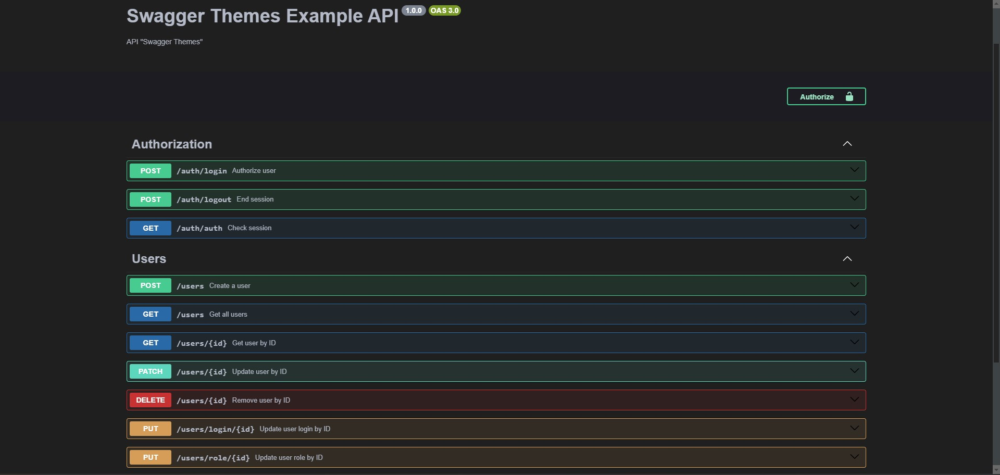

# Swagger themes

## Library documentation language:
  * [EN](#english)
  * [RU](#russian)

## English
> This library adds the ability to "painlessly" change your Swagger documentation theme.

## Installation
### npm
```bash
npm i swagger-themes
```
### yarn
```bash
yarn add swagger-themes
```

## Example usage
### JavaScript
```js
const express = require('express');
const swaggerUi = require('swagger-ui-express');
const { SwaggerTheme } = require('swagger-themes');
const swaggerDocument = require('./swagger.json');

const app = express();
const theme = new SwaggerTheme('v3');

const options = {
  explorer: true,
  customCss: theme.getBuffer('dark')
};

app.use('/api-docs', swaggerUi.serve, swaggerUi.setup(swaggerDocument, options));
```

### TypeScript
```js
import express from 'express';
import swaggerUi from 'swagger-ui-express';
import { SwaggerTheme } from 'swagger-themes';
import swaggerDocument from './swagger.json';

const app = express();
const theme = new SwaggerTheme('v3');

const options = {
  explorer: true,
  customCss: theme.getBuffer('dark')
};

app.use('/api-docs', swaggerUi.serve, swaggerUi.setup(swaggerDocument, options));
```

## Two Swagger document
### JavaScript
```js
const express = require('express');
const swaggerUi = require('swagger-ui-express');
const { SwaggerTheme } = require('swagger-themes');
const swaggerDocument = require('./swagger.json');

const app = express();
const theme = new SwaggerTheme('v3');

const optionsV1 = {
  explorer: true,
  customCss: theme.getBuffer('dark')
};
const optionsV2 = {
  explorer: true,
  customCss: theme.getBuffer('classic')
}

app.use('/api-docs/v1', swaggerUi.serve, swaggerUi.setup(swaggerDocument, optionsV1)); // Dark theme documentation
app.use('/api-docs/v2', swaggerUi.serve, swaggerUi.setup(swaggerDocument, optionsV2)); // Classic theme documentation
```

### TypeScript
```js
import express from 'express';
import swaggerUi from 'swagger-ui-express';
import { SwaggerTheme } from 'swagger-themes';
import swaggerDocument from './swagger.json';

const app = express();
const theme = new SwaggerTheme('v3');

const optionsV1 = {
  explorer: true,
  customCss: theme.getBuffer('dark')
};
const optionsV2 = {
  explorer: true,
  customCss: theme.getBuffer('classic')
}

app.use('/api-docs/v1', swaggerUi.serve, swaggerUi.setup(swaggerDocument, optionsV1)); // Документация с тёмной темой
app.use('/api-docs/v2', swaggerUi.serve, swaggerUi.setup(swaggerDocument, optionsV2)); // Документация с классической темой
```

## Get default config
### JavaScript
```js
const express = require('express');
const swaggerUi = require('swagger-ui-express');
const { SwaggerTheme } = require('swagger-themes');
const swaggerDocument = require('./swagger.json');

const app = express();
const theme = new SwaggerTheme('v3');

const optionsV1 = theme.getDefaultConfig('dark');
const optionsV2 = theme.getDefaultConfig('classic');

app.use('/api-docs/v1', swaggerUi.serve, swaggerUi.setup(swaggerDocument, optionsV1)); // Dark theme documentation
app.use('/api-docs/v2', swaggerUi.serve, swaggerUi.setup(swaggerDocument, optionsV2)); // Classic theme documentation
```

### TypeScript
```js
import express from 'express';
import swaggerUi from 'swagger-ui-express';
import { SwaggerTheme } from 'swagger-themes';
import swaggerDocument from './swagger.json';

const app = express();
const theme = new SwaggerTheme('v3');

const optionsV1 = theme.getDefaultConfig('dark');
const optionsV2 = theme.getDefaultConfig('classic');

app.use('/api-docs/v1', swaggerUi.serve, swaggerUi.setup(swaggerDocument, optionsV1)); // Документация с тёмной темой
app.use('/api-docs/v2', swaggerUi.serve, swaggerUi.setup(swaggerDocument, optionsV2)); // Документация с классической темой
```

## Russian
> Данная библиотека добавляет возможность "без боли" изменять вашу тему документации Swagger.

## Установка
### npm
```bash
npm i swagger-themes
```
### yarn
```bash
yarn add swagger-themes
```

## Пример использования
### JavaScript
```js
const express = require('express');
const swaggerUi = require('swagger-ui-express');
const { SwaggerTheme } = require('swagger-themes');
const swaggerDocument = require('./swagger.json');

const app = express();
const theme = new SwaggerTheme('v3');

const options = {
  explorer: true,
  customCss: theme.getBuffer('dark')
};

app.use('/api-docs', swaggerUi.serve, swaggerUi.setup(swaggerDocument, options));
```

### TypeScript
```js
import express from 'express';
import swaggerUi from 'swagger-ui-express';
import { SwaggerTheme } from 'swagger-themes';
import swaggerDocument from './swagger.json';

const app = express();
const theme = new SwaggerTheme('v3');

const options = {
  explorer: true,
  customCss: theme.getBuffer('dark')
};

app.use('/api-docs', swaggerUi.serve, swaggerUi.setup(swaggerDocument, options));
```

## Два Swagger документа
### JavaScript
```js
const express = require('express');
const swaggerUi = require('swagger-ui-express');
const { SwaggerTheme } = require('swagger-themes');
const swaggerDocument = require('./swagger.json');

const app = express();
const theme = new SwaggerTheme('v3');

const optionsV1 = {
  explorer: true,
  customCss: theme.getBuffer('dark')
};
const optionsV2 = {
  explorer: true,
  customCss: theme.getBuffer('classic')
}

app.use('/api-docs/v1', swaggerUi.serve, swaggerUi.setup(swaggerDocument, optionsV1)); // Документация с тёмной темой
app.use('/api-docs/v2', swaggerUi.serve, swaggerUi.setup(swaggerDocument, optionsV2)); // Документация с классической темой
```

### TypeScript
```js
import express from 'express';
import swaggerUi from 'swagger-ui-express';
import { SwaggerTheme } from 'swagger-themes';
import swaggerDocument from './swagger.json';

const app = express();
const theme = new SwaggerTheme('v3');

const optionsV1 = {
  explorer: true,
  customCss: theme.getBuffer('dark')
};
const optionsV2 = {
  explorer: true,
  customCss: theme.getBuffer('classic')
}

app.use('/api-docs/v1', swaggerUi.serve, swaggerUi.setup(swaggerDocument, optionsV1)); // Документация с тёмной темой
app.use('/api-docs/v2', swaggerUi.serve, swaggerUi.setup(swaggerDocument, optionsV2)); // Документация с классической темой
```

## Get default config
### JavaScript
```js
const express = require('express');
const swaggerUi = require('swagger-ui-express');
const { SwaggerTheme } = require('swagger-themes');
const swaggerDocument = require('./swagger.json');

const app = express();
const theme = new SwaggerTheme('v3');

const optionsV1 = theme.getDefaultConfig('dark');
const optionsV2 = theme.getDefaultConfig('classic');

app.use('/api-docs/v1', swaggerUi.serve, swaggerUi.setup(swaggerDocument, optionsV1)); // Dark theme documentation
app.use('/api-docs/v2', swaggerUi.serve, swaggerUi.setup(swaggerDocument, optionsV2)); // Classic theme documentation
```

### TypeScript
```js
import express from 'express';
import swaggerUi from 'swagger-ui-express';
import { SwaggerTheme } from 'swagger-themes';
import swaggerDocument from './swagger.json';

const app = express();
const theme = new SwaggerTheme('v3');

const optionsV1 = theme.getDefaultConfig('dark');
const optionsV2 = theme.getDefaultConfig('classic');

app.use('/api-docs/v1', swaggerUi.serve, swaggerUi.setup(swaggerDocument, optionsV1)); // Документация с тёмной темой
app.use('/api-docs/v2', swaggerUi.serve, swaggerUi.setup(swaggerDocument, optionsV2)); // Документация с классической темой
```

## Themes | Темы
> classic

> dark


**My contacts:**
  * [VK](https://vk.com/ilya_mixaltik)
  * [Telegram](https://t.me/ilya_mixaltik)