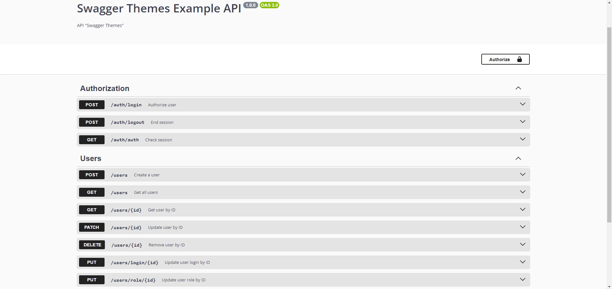
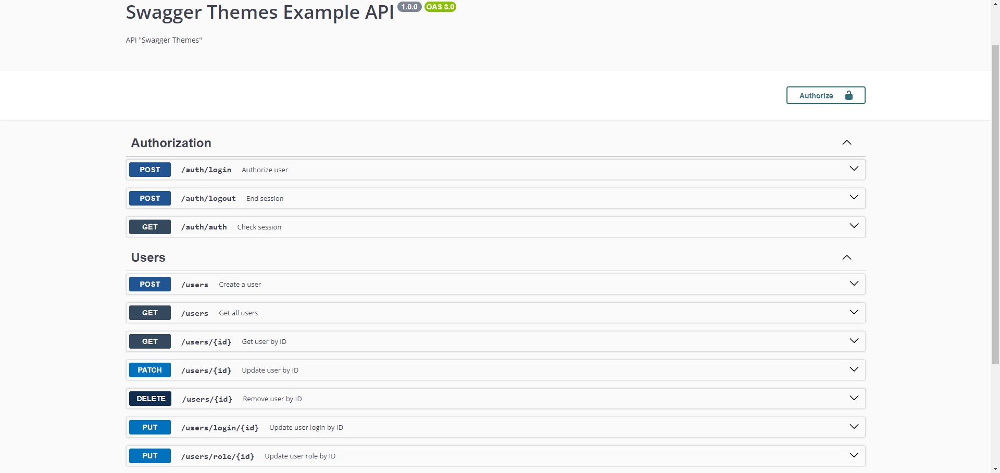

# Swagger themes

## Library documentation language:
  * [EN](#english)
  * [RU](./docs/RU.md)

## Navigation
  * [Installation](#installation)
  * [Example usage](#example-usage)
  * [Two Swagger document](#two-swagger-document)
  * [Get default config](#get-default-config)
  * [Themes](#themes)
  * [Contacts](#my-contacts)

## English
> This library adds the ability to "painlessly" change your Swagger documentation theme.

## Installation
### npm
```bash
npm i swagger-themes
```
### yarn
```bash
yarn add swagger-themes
```

## Example usage
```js
const { SwaggerTheme } = require('swagger-themes');

const theme = new SwaggerTheme('v3'); // Указание версии Swagger
const darkStyle = theme.getBuffer('dark'); // Получение стиля
```

## Использование с Express
### Стандартный пример
```js
const express = require('express');
const swaggerUi = require('swagger-ui-express');
const { SwaggerTheme } = require('swagger-themes');
const swaggerDocument = require('./swagger.json');

const app = express();
const theme = new SwaggerTheme('v3');

const options = {
  explorer: true,
  customCss: theme.getBuffer('dark')
};

app.use('/api-docs', swaggerUi.serve, swaggerUi.setup(swaggerDocument, options));
```

### Two Swagger document
```js
const express = require('express');
const swaggerUi = require('swagger-ui-express');
const { SwaggerTheme } = require('swagger-themes');
const swaggerDocument = require('./swagger.json');

const app = express();
const theme = new SwaggerTheme('v3');

const optionsV1 = {
  explorer: true,
  customCss: theme.getBuffer('dark')
};
const optionsV2 = {
  explorer: true,
  customCss: theme.getBuffer('classic')
}

app.use('/api-docs/v1', swaggerUi.serve, swaggerUi.setup(swaggerDocument, optionsV1)); // Dark theme documentation
app.use('/api-docs/v2', swaggerUi.serve, swaggerUi.setup(swaggerDocument, optionsV2)); // Classic theme documentation
```

### Get default config
```js
const express = require('express');
const swaggerUi = require('swagger-ui-express');
const { SwaggerTheme } = require('swagger-themes');
const swaggerDocument = require('./swagger.json');

const app = express();
const theme = new SwaggerTheme('v3');

const optionsV1 = theme.getDefaultConfig('dark');
const optionsV2 = theme.getDefaultConfig('classic');

app.use('/api-docs/v1', swaggerUi.serve, swaggerUi.setup(swaggerDocument, optionsV1)); // Dark theme documentation
app.use('/api-docs/v2', swaggerUi.serve, swaggerUi.setup(swaggerDocument, optionsV2)); // Classic theme documentation
```

## Themes
> classic

> dark

> outline

> newspaper

> monokai

> feeling-blue


## My contacts
  * [VK](https://vk.com/ilya_mixaltik)
  * [Telegram](https://t.me/ilya_mixaltik)
  * [GitHub](https://github.com/ilyamixaltik)

## Thanks to
- [Mark Ostrander](https://github.com/ostranme) - thanks for some styles

## License (MIT)

Copyright (c) [Ilya Mixaltik](https://github.com/ilyamixaltik)

Permission is hereby granted, free of charge, to any person obtaining a copy of this software and associated documentation files (the "Software"), to deal in the Software without restriction, including without limitation the rights to use, copy, modify, merge, publish, distribute, sublicense, and/or sell copies of the Software, and to permit persons to whom the Software is furnished to do so, subject to the following conditions:

The above copyright notice and this permission notice shall be included in all copies or substantial portions of the Software.

THE SOFTWARE IS PROVIDED "AS IS", WITHOUT WARRANTY OF ANY KIND, EXPRESS OR IMPLIED, INCLUDING BUT NOT LIMITED TO THE WARRANTIES OF MERCHANTABILITY, FITNESS FOR A PARTICULAR PURPOSE AND NONINFRINGEMENT. IN NO EVENT SHALL THE AUTHORS OR COPYRIGHT HOLDERS BE LIABLE FOR ANY CLAIM, DAMAGES OR OTHER LIABILITY, WHETHER IN AN ACTION OF CONTRACT, TORT OR OTHERWISE, ARISING FROM, OUT OF OR IN CONNECTION WITH THE SOFTWARE OR THE USE OR OTHER DEALINGS IN THE SOFTWARE.
