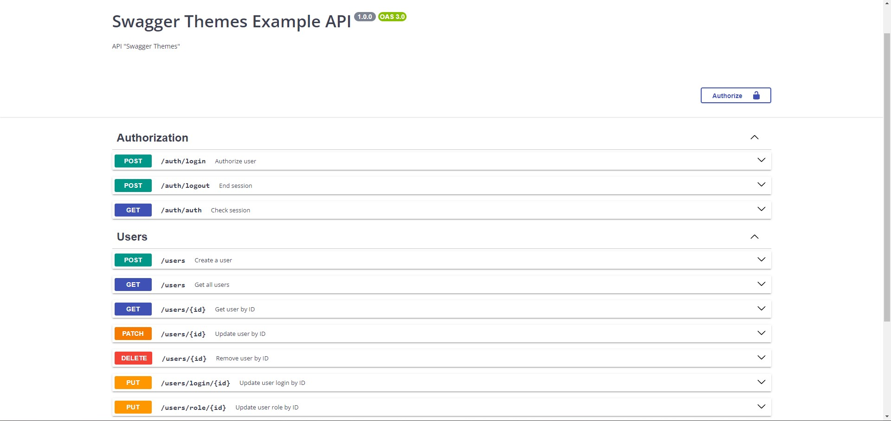

# Swagger themes
[]()
[]()
[]()
[]()
[]()

## Library documentation language:
  * [EN](#english)
  * [RU](./docs/RU.md)
  * [UA](./docs/UA.md)

## Navigation
  * [Installation](#installation)
  * [Example usage](#example-usage)
    * [Use with Express](#use-with-express)
    * [Use with Fastify](#use-with-fastify)
    * [Use with NestJS](#use-with-nestjs)
  * [Themes](#themes)
  * [Contacts](#my-contacts)

## English
> This library adds the ability to "painlessly" change your Swagger documentation theme.

## Installation
### npm
```bash
npm i swagger-themes
```
### yarn
```bash
yarn add swagger-themes
```

## Example usage
> Connecting and using the library
```js
const { SwaggerTheme, SwaggerThemeNameEnum } = require('swagger-themes');

const theme = new SwaggerTheme();
const darkStyle = theme.getBuffer(SwaggerThemeNameEnum.DARK); // Getting a Style
```

## Use with Express
### Standard Example
> Standard dark theme connection with Express. The connection takes place via the swagger-ui-express library
```js
const express = require('express');
const swaggerUi = require('swagger-ui-express');
const { SwaggerTheme; SwaggerThemeNameEnum } = require('swagger-themes');
const swaggerDocument = require('./swagger.json');

const app = express();
const theme = new SwaggerTheme();

const options = {
  explorer: true,
  customCss: theme.getBuffer(SwaggerThemeNameEnum.DARK)
};

app.use('/api-docs', swaggerUi.serve, swaggerUi.setup(swaggerDocument, options));
```

### Two Swagger document
> Connecting 2 documentation files. For example - 2 different themes are used
```js
const express = require('express');
const swaggerUi = require('swagger-ui-express');
const { SwaggerTheme, SwaggerThemeNameEnum } = require('swagger-themes');
const swaggerDocument = require('./swagger.json');

const app = express();
const theme = new SwaggerTheme();

const optionsV1 = {
  explorer: true,
  customCss: theme.getBuffer(SwaggerThemeNameEnum.DARK)
};
const optionsV2 = {
  explorer: true,
  customCss: theme.getBuffer(SwaggerThemeNameEnum.CLASSIC)
}

app.use('/api-docs/v1', swaggerUi.serve, swaggerUi.setup(swaggerDocument, optionsV1)); // Dark theme documentation
app.use('/api-docs/v2', swaggerUi.serve, swaggerUi.setup(swaggerDocument, optionsV2)); // Classic theme documentation
```

### Get default config
> The method of getting the default config for the swagger library is ui-express
```js
const express = require('express');
const swaggerUi = require('swagger-ui-express');
const { SwaggerTheme, SwaggerThemeNameEnum } = require('swagger-themes');
const swaggerDocument = require('./swagger.json');

const app = express();
const theme = new SwaggerTheme();

const optionsV1 = theme.getDefaultConfig(SwaggerThemeNameEnum.DARK);
const optionsV2 = theme.getDefaultConfig(SwaggerThemeNameEnum.CLASSIC);

app.use('/api-docs/v1', swaggerUi.serve, swaggerUi.setup(swaggerDocument, optionsV1)); // Dark theme documentation
app.use('/api-docs/v2', swaggerUi.serve, swaggerUi.setup(swaggerDocument, optionsV2)); // Classic theme documentation
```

## Use with Fastify
### Standard Example
> Standard dark theme connection with Fastify. The connection takes place via the @fastify/swagger and @fastify/swagger-ui library
```js
const fastify = require('fastify')({ logger: true })
const { SwaggerTheme, SwaggerThemeNameEnum } = require('swagger-themes');

const theme = new SwaggerTheme();
const content = theme.getBuffer(SwaggerThemeNameEnum.DARK);

fastify.register(require('@fastify/swagger'));
fastify.register(require('@fastify/swagger-ui'), {
  theme: {
    css: [
      { filename: 'theme.css', content: content }
    ],
  }
})

fastify.listen({ port: 3000 }, (err) => {
  if (err) throw err
})
```

## Use with NestJS
### Standard Example
> Standard dark theme connection with NestJS. The connection takes place via the @nestjs/swagger library
```js
// file main.ts
import { NestFactory } from '@nestjs/core';
import { SwaggerModule, DocumentBuilder } from '@nestjs/swagger';
import { SwaggerTheme, SwaggerThemeNameEnum } from 'swagger-themes';
import { AppModule } from './app.module';

async function bootstrap() {
  const app = await NestFactory.create(AppModule);

  const config = new DocumentBuilder()
    .setTitle('Cats example')
    .setDescription('The cats API description')
    .setVersion('1.0')
    .addTag('cats')
    .build();
  const document = SwaggerModule.createDocument(app, config);
  const theme = new SwaggerTheme();
  const options = {
    explorer: true,
    customCss: theme.getBuffer(SwaggerThemeNameEnum.DARK)
  };
  SwaggerModule.setup('api', app, document, options);

  await app.listen(3000);
}
bootstrap();
```

### Two Swagger document
> Connecting 2 documentation files. For example - 2 different themes are used
```js
// file main.ts
import { NestFactory } from '@nestjs/core';
import { SwaggerModule, DocumentBuilder } from '@nestjs/swagger';
import { SwaggerTheme, SwaggerThemeNameEnum } from 'swagger-themes';
import { AppModule } from './app.module';

async function bootstrap() {
  const app = await NestFactory.create(AppModule);

  const config = new DocumentBuilder()
    .setTitle('Cats example')
    .setDescription('The cats API description')
    .setVersion('1.0')
    .addTag('cats')
    .build();
  const document = SwaggerModule.createDocument(app, config);
  const theme = new SwaggerTheme();
  const optionsV1 = {
    explorer: true,
    customCss: theme.getBuffer(SwaggerThemeNameEnum.DARK)
  };
  const optionsV2 = {
    explorer: true,
    customCss: theme.getBuffer(SwaggerThemeNameEnum.CLASSIC)
  };
  SwaggerModule.setup('api-v1', app, document, optionsV1);
  SwaggerModule.setup('api-v2', app, document, optionsV2);

  await app.listen(3000);
}
bootstrap();
```

### Get default config
> The method of getting the default config for the swagger library is @nestjs/swagger
```js
// file main.ts
import { NestFactory } from '@nestjs/core';
import { SwaggerModule, DocumentBuilder } from '@nestjs/swagger';
import { SwaggerTheme, SwaggerThemeNameEnum } from 'swagger-themes';
import { AppModule } from './app.module';

async function bootstrap() {
  const app = await NestFactory.create(AppModule);

  const config = new DocumentBuilder()
    .setTitle('Cats example')
    .setDescription('The cats API description')
    .setVersion('1.0')
    .addTag('cats')
    .build();
  const document = SwaggerModule.createDocument(app, config);
  const theme = new SwaggerTheme();
  const optionsV1 = theme.getDefaultConfig(SwaggerThemeNameEnum.DARK);
  const optionsV2 = theme.getDefaultConfig(SwaggerThemeNameEnum.CLASSIC);
  
  SwaggerModule.setup('api-v1', app, document, optionsV1);
  SwaggerModule.setup('api-v2', app, document, optionsV2);

  await app.listen(3000);
}
bootstrap();
```

## Themes
> classic

> dark-monokai

> dark

> dracula

> feeling-blue

> flattop

> gruvbox

> material

> monokai

> muted

> newspaper

> nord-dark

> one-dark

> outline


## My contacts
  * [VK](https://vk.com/ilya_mixaltik)
  * [Telegram](https://t.me/ilya_mixaltik)
  * [GitHub](https://github.com/ilyamixaltik)

## Thanks to
- [Mark Ostrander](https://github.com/ostranme) - thanks for some styles
- [oqo0](https://github.com/oqo0) - thanks for some styles
- [Stepan Petei](https://github.com/Stepan-Petei) - thank you for translating the documentation into Ukrainian

[License](https://github.com/ilyamixaltik/swagger-themes/blob/main/LICENSE.md)
