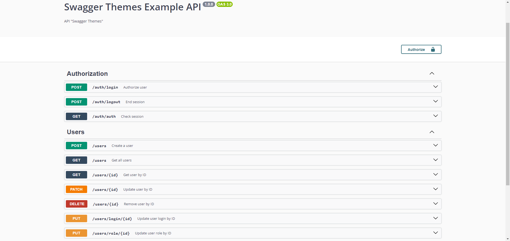
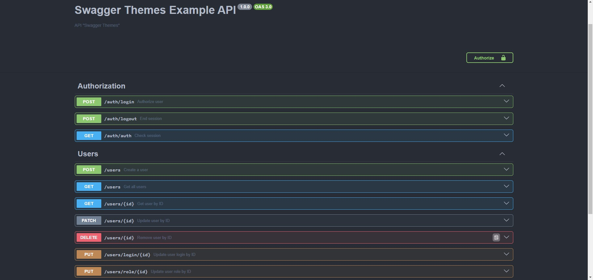

# Swagger темы
[]()
[]()
[]()
[]()
[]()

## Язык документации библиотеки:
* [EN](../README.md)
* [UA](./UA.md)
* [RU](#russian)

## Навигация
* [Установка](#установка)
* [Примеры использования](#примеры-использования)
  * [Использование с Express](#использование-с-express)
  * [Использование с Fastify](#использование-с-fastify)
  * [Использование с NestJS](#использование-с-nestjs)
* [Темы](#темы)
* [Контакты](#мои-контакты)

## Russian
> Данная библиотека добавляет возможность "без боли" изменять вашу тему документации Swagger.

## Установка
### npm
```bash
npm i swagger-themes
```
### yarn
```bash
yarn add swagger-themes
```

## Примеры использования
> Подключение и использование библиотеки
```js
const { SwaggerTheme } = require('swagger-themes');

const theme = new SwaggerTheme();
const darkStyle = theme.getBuffer('dark'); // Получение стиля
```

## Использование с Express
### Стандартный пример
> Стандартное подключение тёмной темы с Express. Подключение происходит через библиотеку swagger-ui-express
```js
const express = require('express');
const swaggerUi = require('swagger-ui-express');
const { SwaggerTheme } = require('swagger-themes');
const swaggerDocument = require('./swagger.json');

const app = express();
const theme = new SwaggerTheme();

const options = {
  explorer: true,
  customCss: theme.getBuffer('dark')
};

app.use('/api-docs', swaggerUi.serve, swaggerUi.setup(swaggerDocument, options));
```

### Два Swagger документа
> Подключение 2 файлов документации. Для примера - используется 2 разные темы
```js
const express = require('express');
const swaggerUi = require('swagger-ui-express');
const { SwaggerTheme } = require('swagger-themes');
const swaggerDocument = require('./swagger.json');

const app = express();
const theme = new SwaggerTheme();

const optionsV1 = {
  explorer: true,
  customCss: theme.getBuffer('dark')
};
const optionsV2 = {
  explorer: true,
  customCss: theme.getBuffer('classic')
}

app.use('/api-docs/v1', swaggerUi.serve, swaggerUi.setup(swaggerDocument, optionsV1)); // Тёмная тема документации
app.use('/api-docs/v2', swaggerUi.serve, swaggerUi.setup(swaggerDocument, optionsV2)); // Классическая тема документации
```

### Получить конфиг по-умолчанию
> Метод получения конфига по-умолчанию для библиотеки swagger-ui-express
```js
const express = require('express');
const swaggerUi = require('swagger-ui-express');
const { SwaggerTheme } = require('swagger-themes');
const swaggerDocument = require('./swagger.json');

const app = express();
const theme = new SwaggerTheme();

const optionsV1 = theme.getDefaultConfig('dark');
const optionsV2 = theme.getDefaultConfig('classic');

app.use('/api-docs/v1', swaggerUi.serve, swaggerUi.setup(swaggerDocument, optionsV1)); // Тёмная тема документации
app.use('/api-docs/v2', swaggerUi.serve, swaggerUi.setup(swaggerDocument, optionsV2)); // Классическая тема документации
```

## Использование с Fastify
### Стандартный пример
> Стандартное подключение тёмной темы с Fastify. Подключение происходит через библиотеки @fastify/swagger и @fastify/swagger-ui
```js
const fastify = require('fastify')({ logger: true })
const { SwaggerTheme } = require('swagger-themes');

const theme = new SwaggerTheme();
const content = theme.getBuffer('dark');

fastify.register(require('@fastify/swagger'));
fastify.register(require('@fastify/swagger-ui'), {
  theme: {
    css: [
      { filename: 'theme.css', content: content }
    ],
  }
})

fastify.listen({ port: 3000 }, (err) => {
  if (err) throw err
})
```

## Использование с NestJS
### Стандартный пример
> Стандартное подключение тёмной темы с NestJS. Подключение происходит через библиотеку @nestjs/swagger
```js
// файл main.ts
import { NestFactory } from '@nestjs/core';
import { SwaggerModule, DocumentBuilder } from '@nestjs/swagger';
import { SwaggerTheme } from 'swagger-themes';
import { AppModule } from './app.module';

async function bootstrap() {
  const app = await NestFactory.create(AppModule);

  const config = new DocumentBuilder()
    .setTitle('Cats example')
    .setDescription('The cats API description')
    .setVersion('1.0')
    .addTag('cats')
    .build();
  const document = SwaggerModule.createDocument(app, config);
  const theme = new SwaggerTheme();
  const options = {
    explorer: true,
    customCss: theme.getBuffer('dark')
  };
  SwaggerModule.setup('api', app, document, options);

  await app.listen(3000);
}
bootstrap();
```

### Два Swagger документа
> Подключение 2 файлов документации. Для примера - используется 2 разные темы
```js
// файл main.ts
import { NestFactory } from '@nestjs/core';
import { SwaggerModule, DocumentBuilder } from '@nestjs/swagger';
import { SwaggerTheme } from 'swagger-themes';
import { AppModule } from './app.module';

async function bootstrap() {
  const app = await NestFactory.create(AppModule);

  const config = new DocumentBuilder()
    .setTitle('Cats example')
    .setDescription('The cats API description')
    .setVersion('1.0')
    .addTag('cats')
    .build();
  const document = SwaggerModule.createDocument(app, config);
  const theme = new SwaggerTheme();
  const optionsV1 = {
    explorer: true,
    customCss: theme.getBuffer('dark')
  };
  const optionsV2 = {
    explorer: true,
    customCss: theme.getBuffer('classic')
  };
  SwaggerModule.setup('api-v1', app, document, optionsV1);
  SwaggerModule.setup('api-v2', app, document, optionsV2);

  await app.listen(3000);
}
bootstrap();
```

### Получить конфиг по-умолчанию
> Метод получения конфига по-умолчанию для библиотеки @nestjs/swagger
```js
// файл main.ts
import { NestFactory } from '@nestjs/core';
import { SwaggerModule, DocumentBuilder } from '@nestjs/swagger';
import { SwaggerTheme } from 'swagger-themes';
import { AppModule } from './app.module';

async function bootstrap() {
  const app = await NestFactory.create(AppModule);

  const config = new DocumentBuilder()
    .setTitle('Cats example')
    .setDescription('The cats API description')
    .setVersion('1.0')
    .addTag('cats')
    .build();
  const document = SwaggerModule.createDocument(app, config);
  const theme = new SwaggerTheme();
  const optionsV1 = theme.getDefaultConfig('dark');
  const optionsV2 = theme.getDefaultConfig('classic');
  
  SwaggerModule.setup('api-v1', app, document, optionsV1);
  SwaggerModule.setup('api-v2', app, document, optionsV2);

  await app.listen(3000);
}
bootstrap();
```

## Темы
> classic

> dark-monokai

> dark

> dracula

> feeling-blue

> flattop

> gruvbox

> material

> monokai

> muted

> newspaper

> nord-dark

> one-dark

> outline


## Мои контакты
* [VK](https://vk.com/ilya_mixaltik)
* [Telegram](https://t.me/ilya_mixaltik)
* [GitHub](https://github.com/ilyamixaltik)

## Благодаря
- [Mark Ostrander](https://github.com/ostranme) - спасибо за несколько стилей
- [oqo0](https://github.com/oqo0) - спасибо за несколько стилей
- [Stepan Petei](https://github.com/Stepan-Petei) - спасибо за перевод документации на украинский язык

[Лицензия](https://github.com/ilyamixaltik/swagger-themes/blob/main/LICENSE.md)
