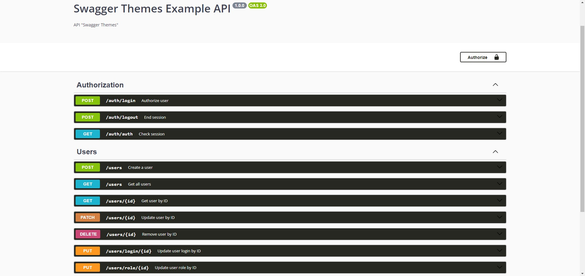

# Swagger темы

## Язык документации библиотеки:
* [EN](../README.md)
* [UA](./UA.md)
* [RU](#russian)

## Навигация
* [Установка](#установка)
* [Примеры использования](#примеры-использования)
* [Два Swagger документа](#два-swagger-документа)
* [Получить конфиг по-умолчанию](#получить-конфиг-по-умолчанию)
* [Темы](#темы)
* [Контакты](#мои-контакты)

## Russian
> Данная библиотека добавляет возможность "без боли" изменять вашу тему документации Swagger.

## Установка
### npm
```bash
npm i swagger-themes
```
### yarn
```bash
yarn add swagger-themes
```

## Примеры использования
> Подключение и использование библиотеки
```js
const { SwaggerTheme } = require('swagger-themes');

const theme = new SwaggerTheme('v3'); // Указание версии Swagger
const darkStyle = theme.getBuffer('dark'); // Получение стиля
```

## Использование с Express
### Стандартный пример
> Стандартное подключение тёмной темы с Express. Подключение происходит через библиотеку swagger-ui-express
```js
const express = require('express');
const swaggerUi = require('swagger-ui-express');
const { SwaggerTheme } = require('swagger-themes');
const swaggerDocument = require('./swagger.json');

const app = express();
const theme = new SwaggerTheme('v3');

const options = {
  explorer: true,
  customCss: theme.getBuffer('dark')
};

app.use('/api-docs', swaggerUi.serve, swaggerUi.setup(swaggerDocument, options));
```

### Два Swagger документа
> Подключение 2 файлов документации. Для примера - используется 2 разные темы
```js
const express = require('express');
const swaggerUi = require('swagger-ui-express');
const { SwaggerTheme } = require('swagger-themes');
const swaggerDocument = require('./swagger.json');

const app = express();
const theme = new SwaggerTheme('v3');

const optionsV1 = {
  explorer: true,
  customCss: theme.getBuffer('dark')
};
const optionsV2 = {
  explorer: true,
  customCss: theme.getBuffer('classic')
}

app.use('/api-docs/v1', swaggerUi.serve, swaggerUi.setup(swaggerDocument, optionsV1)); // Тёмная тема документации
app.use('/api-docs/v2', swaggerUi.serve, swaggerUi.setup(swaggerDocument, optionsV2)); // Классическая тема документации
```

### Получить конфиг по-умолчанию
> Метод получения конфига по-умолчанию для библиотеки swagger-ui-express
```js
const express = require('express');
const swaggerUi = require('swagger-ui-express');
const { SwaggerTheme } = require('swagger-themes');
const swaggerDocument = require('./swagger.json');

const app = express();
const theme = new SwaggerTheme('v3');

const optionsV1 = theme.getDefaultConfig('dark');
const optionsV2 = theme.getDefaultConfig('classic');

app.use('/api-docs/v1', swaggerUi.serve, swaggerUi.setup(swaggerDocument, optionsV1)); // Тёмная тема документации
app.use('/api-docs/v2', swaggerUi.serve, swaggerUi.setup(swaggerDocument, optionsV2)); // Классическая тема документации
```

## Темы
> classic

> dark

> feeling-blue

> flattop

> material

> monokai

> muted

> newspaper

> outline


## Мои контакты
* [VK](https://vk.com/ilya_mixaltik)
* [Telegram](https://t.me/ilya_mixaltik)
* [GitHub](https://github.com/ilyamixaltik)

## Благодаря
- [Mark Ostrander](https://github.com/ostranme) - спасибо за несколько стилей
- [Stepan Petei](https://github.com/Stepan-Petei) - спасибо за перевод документации на украинский язык

[Лицензия](https://github.com/ilyamixaltik/swagger-themes/blob/main/LICENSE.md)