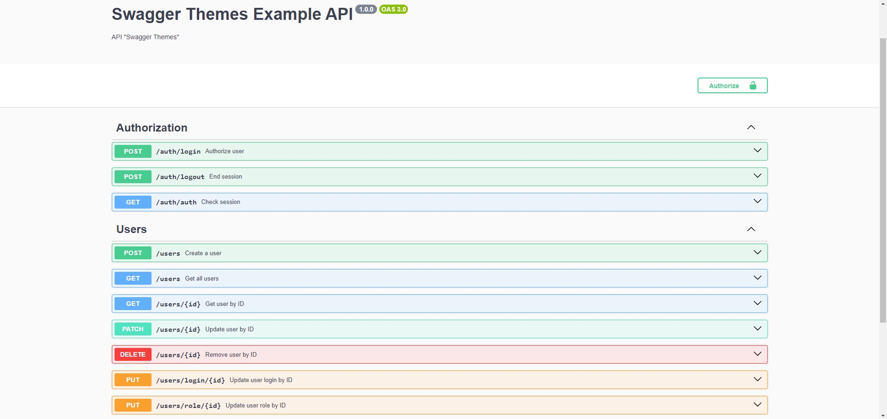
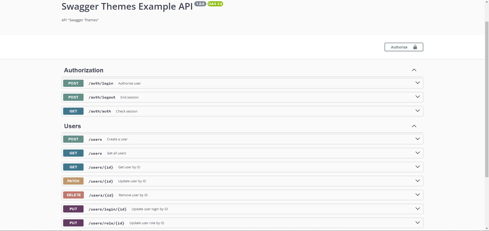

# Swagger теми

## Мова документації бібліотеки:
* [EN](../README.md)
* [UA](##Ukrainian)
* [RU](./RU.md)

## Навігація
* [Установка](#установка)
* [Приклади використання](#приклади-використання)
* [Два Swagger документи](#два-swagger-документи)
* [Отримати конфіг по замовчуванню](#отримати-конфіг-по-замовчуванню)
* [Теми](#теми)
* [Контакти](#мої-контакти)

## Ukrainian
> Дана бібліотека додає можливість "безболісно" міняти вашу тему документації Swagger.

## Установка
### npm
```bash
npm i swagger-themes
```
### yarn
```bash
yarn add swagger-themes
```

## Приклади використання
> Підключення та використання бібліотеки
```js
const { SwaggerTheme } = require('swagger-themes');

const theme = new SwaggerTheme('v3'); // Вказування версії Swagger
const darkStyle = theme.getBuffer('dark'); // Отримання стилю
```

## Використання з Express
### Стандартний приклад
> Стандартне підключення темної теми з Express. Підключення відбувається через бібліотеку swagger-ui-express
```js
const express = require('express');
const swaggerUi = require('swagger-ui-express');
const { SwaggerTheme } = require('swagger-themes');
const swaggerDocument = require('./swagger.json');

const app = express();
const theme = new SwaggerTheme('v3');

const options = {
  explorer: true,
  customCss: theme.getBuffer('dark')
};

app.use('/api-docs', swaggerUi.serve, swaggerUi.setup(swaggerDocument, options));
```

### Два Swagger документи
> Підключення 2 файлів документації. Для прикладу - використовується 2 різні теми
```js
const express = require('express');
const swaggerUi = require('swagger-ui-express');
const { SwaggerTheme } = require('swagger-themes');
const swaggerDocument = require('./swagger.json');

const app = express();
const theme = new SwaggerTheme('v3');

const optionsV1 = {
  explorer: true,
  customCss: theme.getBuffer('dark')
};
const optionsV2 = {
  explorer: true,
  customCss: theme.getBuffer('classic')
}

app.use('/api-docs/v1', swaggerUi.serve, swaggerUi.setup(swaggerDocument, optionsV1)); // Темна тема документації
app.use('/api-docs/v2', swaggerUi.serve, swaggerUi.setup(swaggerDocument, optionsV2)); // Класична тема документації
```

### Отримати конфіг по замовчуванню
> Метод отримання конфігу по замовчуванню для бібліотеки swagger-ui-express
```js
const express = require('express');
const swaggerUi = require('swagger-ui-express');
const { SwaggerTheme } = require('swagger-themes');
const swaggerDocument = require('./swagger.json');

const app = express();
const theme = new SwaggerTheme('v3');

const optionsV1 = theme.getDefaultConfig('dark');
const optionsV2 = theme.getDefaultConfig('classic');

app.use('/api-docs/v1', swaggerUi.serve, swaggerUi.setup(swaggerDocument, optionsV1)); // Темна тема документації
app.use('/api-docs/v2', swaggerUi.serve, swaggerUi.setup(swaggerDocument, optionsV2)); // Класична тема документації
```

## Темы
> classic

> dark

> feeling-blue

> flattop

> material

> monokai

> muted

> newspaper

> outline


## Мої контакти
* [VK](https://vk.com/ilya_mixaltik)
* [Telegram](https://t.me/ilya_mixaltik)
* [GitHub](https://github.com/ilyamixaltik)

## Thanks to
- [Mark Ostrander](https://github.com/ostranme) - дякую за кілька стилів

## License (MIT)

Copyright (c) [Ілля Міхальчик](https://github.com/ilyamixaltik)

Цим надається безкоштовний дозвіл будь-якій особі, яка отримує копію цього програмного забезпечення та пов'язаних з нею файлів документації ("Програмне забезпечення"), на використання Програмного забезпечення без обмежень, включаючи, без обмежень, права на використання, копіювання, зміну, об'єднання, публікацію, розповсюдження, субліцензування та/або продавати копії Програмного забезпечення та дозволяти особам, яким надається Програмне забезпечення, робити це за умови дотримання таких умов:

Вищевказане повідомлення про авторські права та це повідомлення про дозвіл повинні бути включені до всіх копій або суттєвих частин Програмного забезпечення.

ПРОГРАМНЕ ЗАБЕЗПЕЧЕННЯ НАДАЄТЬСЯ "ЯК Є", БЕЗ БУДЬ-ЯКИХ ГАРАНТІЙ, ЯВНИХ АБО ЯКІ МАЮТЬСЯ НА УВАЗІ, ВКЛЮЧАЮЧИ, АЛЕ НЕ ОБМЕЖУЮЧИСЬ ГАРАНТІЯМИ ТОВАРНОЇ ПРИДАТНОСТІ, ПРИДАТНОСТІ ДЛЯ ПЕВНОЇ ЦІЛІ ТА ВІДСУТНОСТІ ПОРУШЕНЬ. НІ В ЯКОМУ ВИПАДКУ АВТОРИ АБО ПРАВОВЛАСНИКИ НЕ НЕСУТЬ ВІДПОВІДАЛЬНІСТЬ ЗА БУДЬ-ЯКІ ПРЕТЕНЗІЇ, ЗБИТКИ АБО ІНШУ ВІДПОВІДАЛЬНСТЬ, ЧИ ТО В РЕЗУЛЬТАТІ ДІЇ ДОГОВОРУ, ДЕЛІКТУ АБО ІНШИМ ЧИНОМ, ЯКІ ВИПЛИВАЮТЬ З ПРОГРАМНОГО ЗАБЕЗПЕЧЕННЯ АБО В ЗВ'ЯЗКУ З НИМ АБО ВИКОРИСТАННЯМ АБО ІНШИМИ ДІЯМИ З ПРОГРАМНИМ ЗАБЕЗПЕЧЕННЯ.